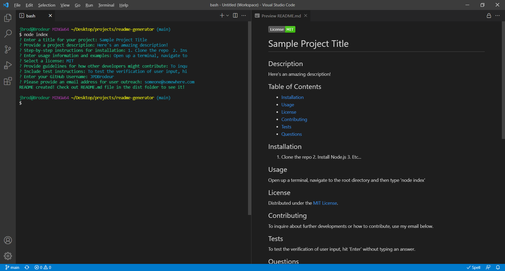

# Professional README Generator

## Description

You can quickly and easily generate a README file by using a command-line application to generate one. This allows the project creator to devote more time working on the project.

## Table of Contents

* [Installation](#installation)
* [Usage](#usage)
* [License](#license)
* [Questions](#questions)

## Installation

1. Download this repo 
2. Install Node.js 
3. Install Inquirer 

## Usage

1. Open a Terminal
2. Navigate to the root folder of the repo 
3. Type 'node index' and hit enter
4. Answer each prompt
5. Once completed, access your README file in the /dist subdirectory

 👉 View a [Video Walkthrough](https://watch.screencastify.com/v/KgGnlCtLaVRH3IRAf7ck)

## License

Distributed under the [Unlicense](https://choosealicense.com/licenses/unlicense/).

## Questions

* GitHub Profile: [JPDBrodeur](https://github.com/JPDBrodeur)

* Have any additional questions? You can reach me by email at [jbrodeur001@gmail.com](mailto:jbrodeur001@gmail.com).
    
